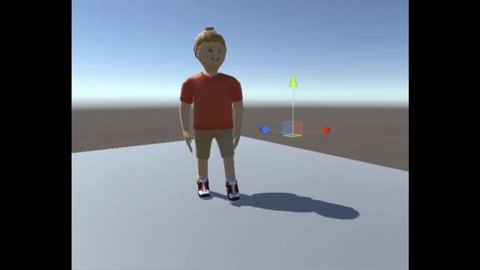
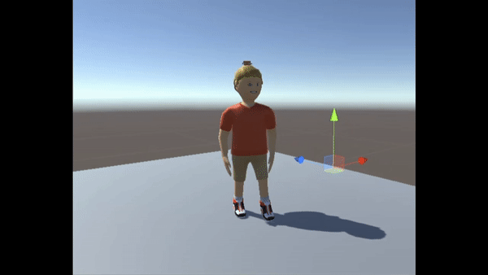
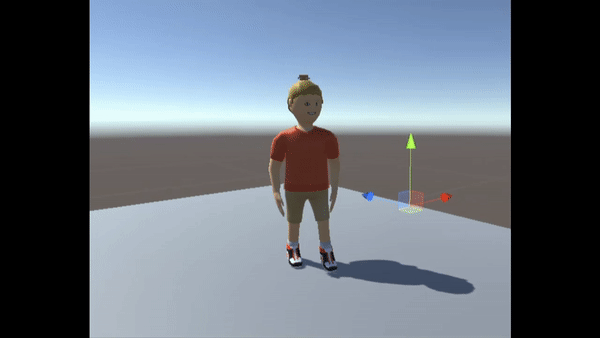

# GuitaristAdventure

## 8/16/2020

Welome to the Guitarist Adventure blogpost thingy. I don't know what to call this, but this readme file will be where I share updates on the current state of the game. Guitarist Adventure is the most ambitious game that I have attempted to make. With this in mind, I thought it would be a good idea to post updates on the game to keep me motivated as well as show that I have not given up on the project. 

### Game Info
Guitarist Adventure is a platformer game where you play as a guitarist who must fight off monsters and complete each level. Your guitar is your single utility. The guitar can be used as a pogo-stick which allows you to jump higher than a person normally would. The guitar can be used as a shield to block incoming enemy projectiles. The guitar can be used as a weapon to swing and attack enemies. And, of course, you can play the guitar which creates a serenade effect, immobilizing enemies. 

Jumping

Blocking

Attacking

Serenading

Your character is fully customizable. Choose your hairstyle/color, shirt style/color, pants style/color, guitar shape/color, sock type/color, shoe type, and skin tone.

There are two types of enemies. The regular Monster has a gun that shoots *sharp* objects. As a player, you have to dodge and block incoming projectiles as you close try and kill the monster. The second type of monster, called the Smasher, has no gun but is very mobile. The Smasher can follow up platforms using the jump pack on its back. The quick punch rate of the Smasher can be deadly so don't let it get too close.

Both enemy types are vulnerable to attacks from behind, especially the Smasher. Try to jump over the enemy's head and attack them from behind before they turn around.
